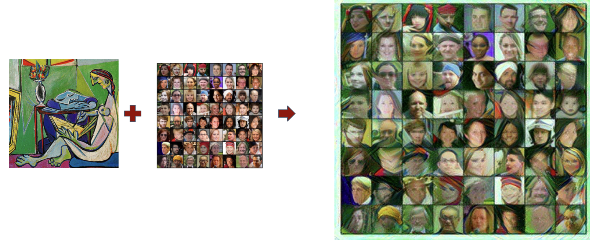

# Face Generation GANs

This project is a part of [CSCI-P 556 APPLIED MACHINE LEARNING](https://luddy.indiana.edu/academics/courses/class/iub-spring-2021-csci-p556) course during my [Master's Data Science](https://datascience.indiana.edu/programs/residential/index.html) at Indiana University Bloomington 

--------
[Syllabus : Project Details](files/Project_Details.pdf)

### Milestone 1 : [Project Proposal](Files/Project_Proposal.pdf)
### Milestone 2 : [Progress Report](Files/First_Report.pdf)
### Submsission Code : [GANs Face Generators](face_generator_gans.ipynb)
### Final Presentation : [Slides](Files/Final_proj_gans.pdf)

### Step by Step Output of Generating Realistic Faces from random noise 

### Generated Image + Neural Style Transfer 

